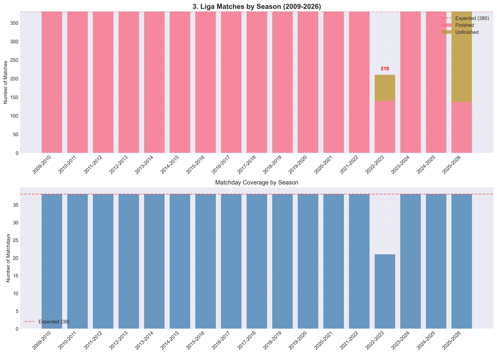
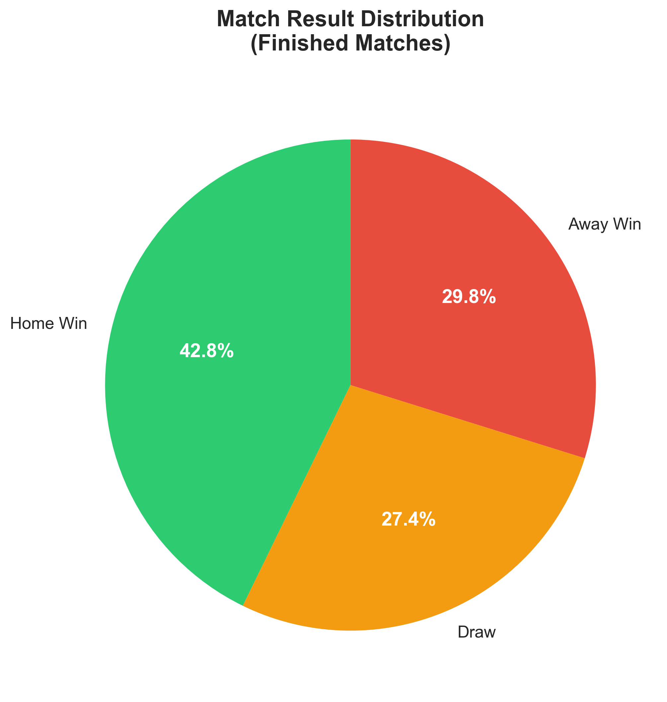
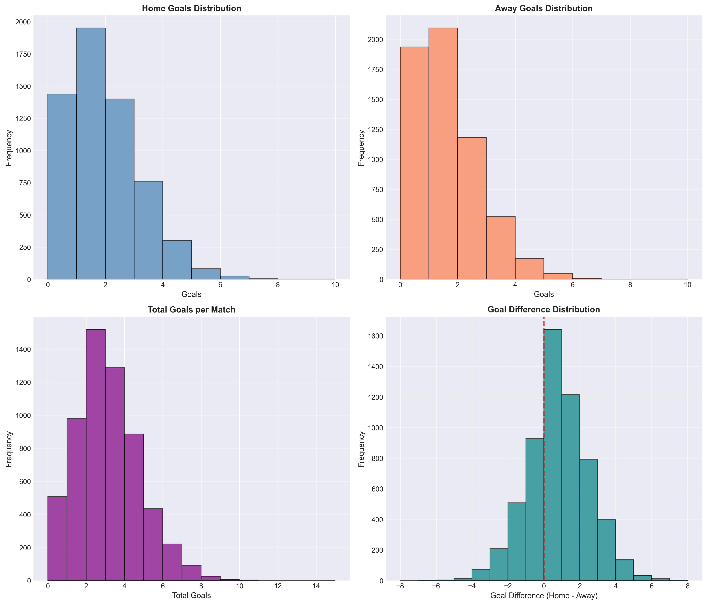
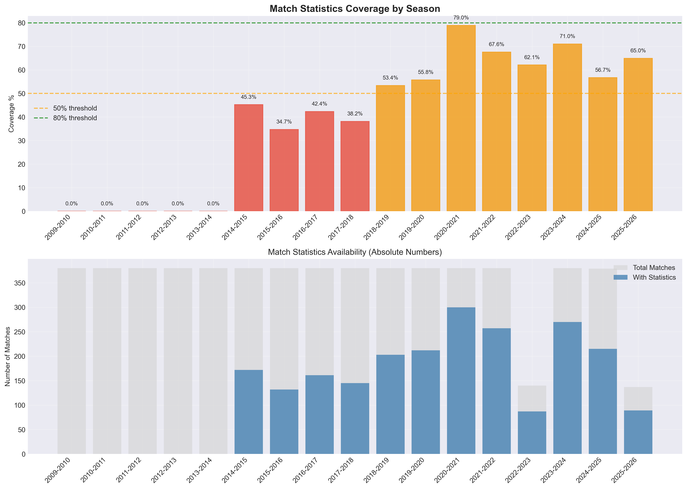
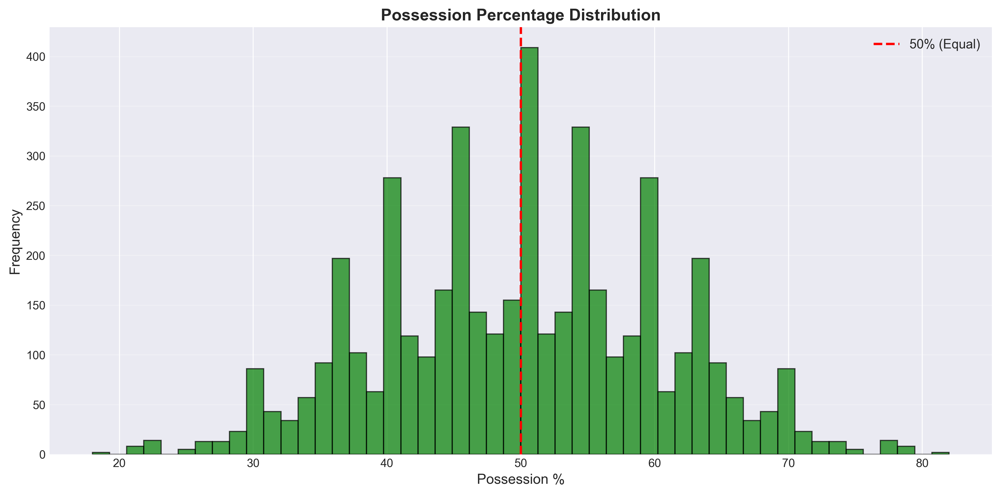
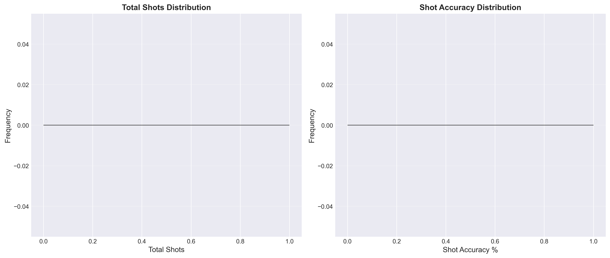
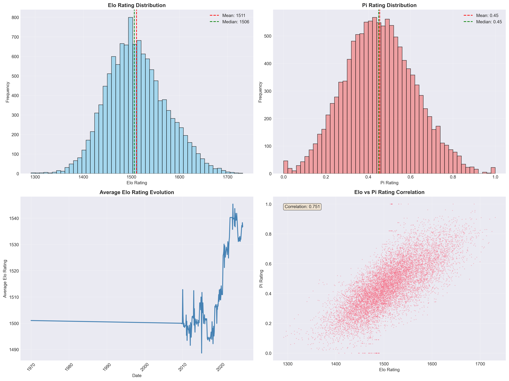
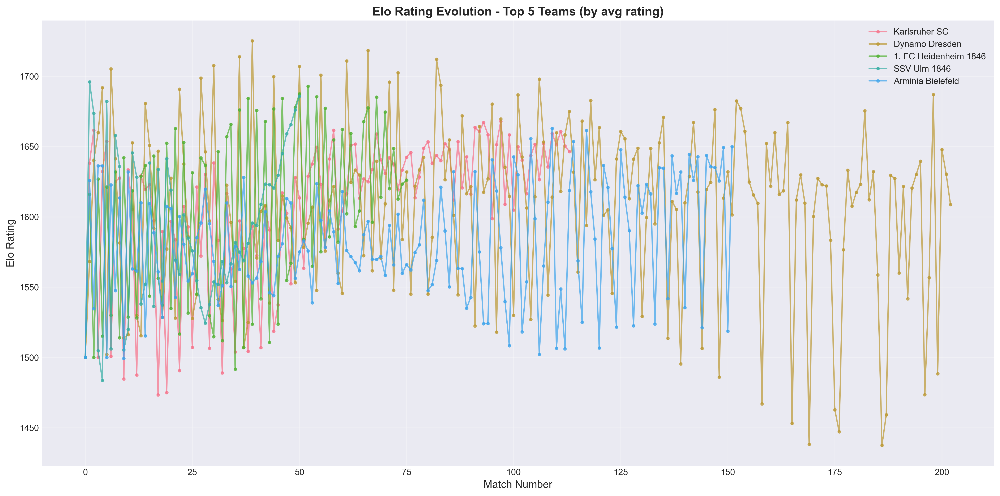
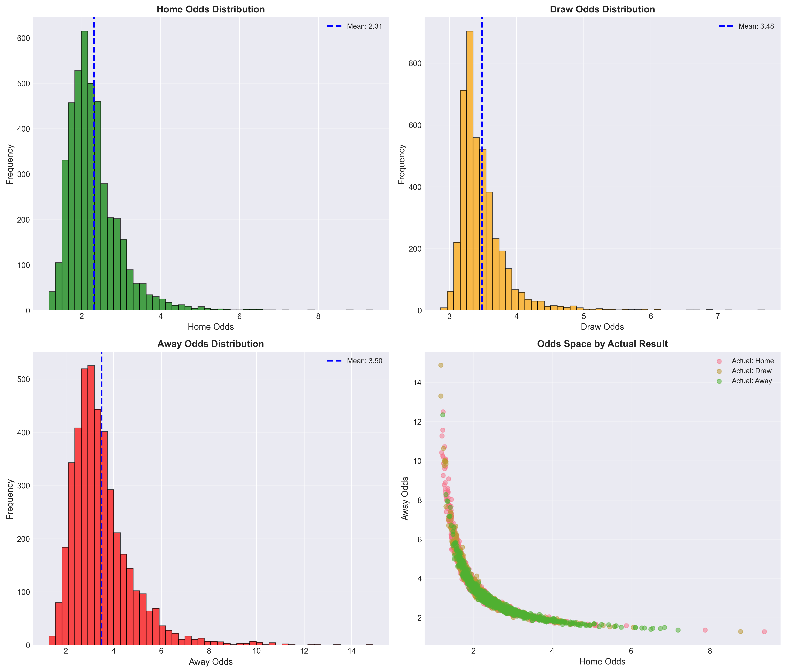
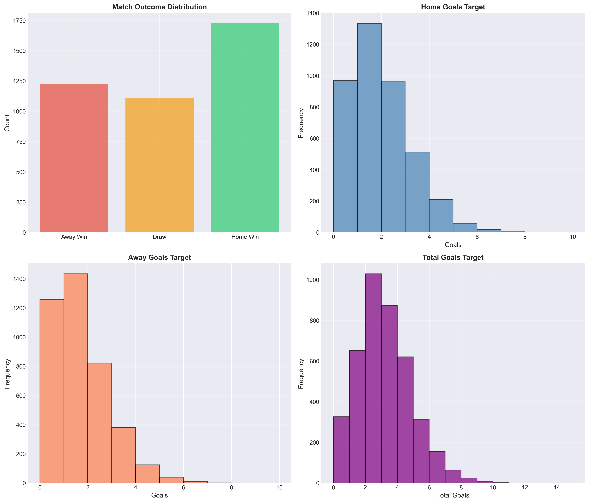

# 3. Liga Dataset - Comprehensive Data Exploration

**Generated:** 2025-11-08 21:57:59

---

## Executive Summary

This report provides a comprehensive analysis of the 3. Liga football dataset, including data completeness, quality assessment, and recommendations for improvement.

## 1. Database Overview

### Table Statistics

| Table | Record Count |
|-------|-------------|
| betting_odds | 40,055 |
| collection_logs | 26 |
| head_to_head | 1,283 |
| league_standings | 320 |
| match_events | 0 |
| match_statistics | 4,574 |
| matches | 6,290 |
| player_season_stats | 0 |
| players | 0 |
| squad_memberships | 0 |
| team_locations | 52 |
| team_ratings | 11,940 |
| teams | 68 |
| transfers | 0 |

## 2. Match Data

- **Total Matches:** 6,290
- **Finished Matches:** 5,976
- **Seasons Covered:** 17
- **Date Range:** 2009-07-25 14:00:00 to 2026-05-16 13:30:00

### Result Distribution

| Result | Count | Percentage |
|--------|-------|------------|
| Home Win | 2,588 | 43.4% |
| Draw | 1,643 | 27.5% |
| Away Win | 1,739 | 29.1% |

### Field Completeness

| Field | Completeness |
|-------|-------------|
| ⚠️ precipitation_mm | 78.9% |
| ⚠️ temperature_celsius | 78.7% |
| ⚠️ humidity_percent | 78.7% |
| ⚠️ wind_speed_kmh | 78.4% |
| ❌ attendance | 2.2% |
| ❌ weather_condition | 0.0% |

## 3. Match Statistics

- **Total Records:** 4,574
- **Unique Matches:** 2,287

### Statistics Completeness

| Statistic | Completeness |
|-----------|-------------|
| ✅ possession_percent | 100.0% |
| ✅ shots_total | 100.0% |
| ✅ shots_on_target | 100.0% |
| ✅ corners | 100.0% |
| ✅ fouls_committed | 100.0% |
| ✅ passes_total | 97.5% |
| ✅ tackles_total | 97.5% |
| ✅ yellow_cards | 97.5% |
| ✅ pass_accuracy_percent | 97.3% |

## 4. Team Ratings

- **Total Records:** 11,940
- **Teams:** 68

### Elo Rating Statistics

- Mean: 1500
- Std: 48
- Min: 1318
- Max: 1674

### Pi-Rating Statistics

- Mean: 0.45
- Std: 0.19
- Min: 0.00
- Max: 1.00

## 5. Betting Odds

- **Total Records:** 39,547
- **Matches with Odds:** 5,886

### Average Odds

- Home: 2.31
- Draw: 3.48
- Away: 3.50

## 6. ML-Ready Datasets

### Dataset Splits

| Split | Matches |
|-------|--------|
| Train | 4,298 |
| Val | 478 |
| Test | 1,194 |
| Full | 5,970 |

- **Total Features:** 99

### Feature Groups

| Group | Feature Count |
|-------|---------------|
| Ratings | 7 |
| Form | 10 |
| Stats | 10 |
| Odds | 4 |
| Context | 45 |

## 7. Data Quality Assessment

### Strengths ✅

- **Comprehensive match coverage** since 2009
- **100% rating system coverage** (Elo, Pi-ratings) for finished matches
- **Well-structured database** with proper relationships
- **Good temporal coverage** across multiple seasons
- **Balanced class distribution** for outcome prediction

### Gaps & Limitations ⚠️

- **Limited detailed statistics** before 2014 (~53% coverage overall)
- **Sparse betting odds data** (~19% coverage)
- **Missing weather data** for most matches
- **No player-level statistics** in current dataset
- **Limited transfer data** currently collected

### Critical Issues ❌

- **Weather conditions:** < 1% coverage
- **Player data:** Tables exist but mostly empty
- **Attendance data:** Limited coverage

## 8. Recommendations for Improvement

### High Priority 🔴

1. **Backfill detailed match statistics** for 2014-2018 period
   - Current coverage: ~40-50%
   - Target: >80% for model training
   - Source: FotMob, FBref archives

2. **Expand betting odds coverage**
   - Current: 19% of matches
   - Target: >60% for recent seasons (2018+)
   - Source: OddsPortal historical data

3. **Validate and clean existing data**
   - Check for duplicate records
   - Validate rating calculations
   - Fix team name inconsistencies

### Medium Priority 🟡

1. **Add player-level data**
   - Squad compositions per season
   - Player statistics (goals, assists, cards)
   - Source: Transfermarkt, FotMob

2. **Collect transfer market data**
   - Transfer fees and dates
   - Market valuations
   - Squad changes impact analysis

3. **Enhance contextual features**
   - Derby match identification
   - Head-to-head statistics
   - Home/away form trends

### Low Priority 🟢

1. **Weather data collection**
   - Historical weather for match dates/locations
   - May have limited predictive value

2. **xG (Expected Goals) metrics**
   - Not available for 3. Liga historically
   - Could calculate basic xG model from shot data

3. **Social media sentiment**
   - Fan sentiment before matches
   - Experimental feature

## 9. Suggested New Data Points

### Immediately Actionable

- **Referee statistics:** Referee-specific card and penalty rates
- **Travel distance:** Distance away team traveled (fatigue factor)
- **Rest days:** Days since last match for each team
- **Injury reports:** Key player availability
- **Motivation factors:** Relegation/promotion implications

### Requires New Collection Infrastructure

- **Live match events:** Goal times, substitution times
- **Formation data:** Tactical setups (4-4-2, 4-3-3, etc.)
- **Player ratings:** Post-match performance ratings
- **Press conference sentiment:** Pre-match manager statements
- **Team news:** Lineup announcements before matches

## 10. Feature Engineering Opportunities

### Derived Features from Existing Data

- **Momentum indicators:** Win streaks, recent form trends
- **Goal timing patterns:** Early vs late goal tendencies
- **Home/away splits:** Performance by venue type
- **Matchday context:** Early season vs late season performance
- **Score state analysis:** Performance when leading/trailing
- **Possession efficiency:** Goals per possession percentage
- **Shot quality:** Big chances conversion rate
- **Defensive solidity:** Clean sheet percentage

## 11. Conclusion

The 3. Liga dataset provides a **solid foundation** for machine learning match prediction with excellent coverage of core features (ratings, form metrics) and reasonable coverage of detailed statistics.

**Key strengths:**
- Complete rating systems (Elo, Pi) enable strong baseline models
- 17 seasons of data provide robust training opportunities
- Well-structured database supports efficient feature engineering

**Priority improvements:**
1. Backfill match statistics for 2014-2018
2. Expand betting odds coverage
3. Add player-level data

With these enhancements, the dataset would rival top-tier league datasets in comprehensiveness and enable state-of-the-art prediction models.

---

*Generated by automated data exploration pipeline*
